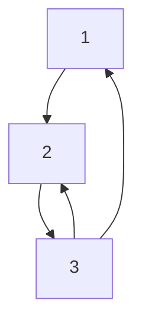

# Graph Creation

## Overview 

This project aims to determine the best strategy for Graph creation based on provided machine and its specifications.

### Input 

As an input we have Graphs described as an **unweighted** **directed** `edge list`. Data has been gathered from [Data sources](./data_sources). Here's an example below :

**Graphical representation**



**File content**

| Content |
| ------- |
| 1 2     |
| 2 3     |
| 3 1     |
| 3 2     |

### Output 

We need to create the graph using a certain **strategy** and save the graph as an `adjacency list`. The Structure of the adjacency list differs based on the data structure used ( explained in the technical overview ). Here's an example using a `vector of vectors` and the initial graph represented above.

```cpp
[
    [2],
    [3],
    [1, 2]
]
```

Our aim is to produce this representation in memory using minimal resources ( CPU / RAM )


## Technical Overview

The entire project was written in `c++`. And can be divided to two main parts

### Initial Implementation

Each of the strategies has its respective `cmake` project, making it simpler to test them individually

- `Parallel` : the parallel creation strategy
- `Sequential` : The sequential creation Strategy
- `Strategy3` : The sequential split creation strategy

Each of these projects will run the underlying strategy on the provided input. And then will calculate performance based on certain metrics.

### Newer Implementation

This implementation provides a couple of improvements to the initial one. Can be found under `/PFATeam` as a separate `cmake` project


#### Testing multiple Data Structures

We can now test multiple *Graph data structures* for each implementation ( which can differ in performance based on the provided initial graph)

**9 Adjacency list Strcutures have been implemented** : 

- `vector of vectors` : each vector representing the ajcent elements of 1 `vertex`
- `vector of sets`
- `vector of unordered sets` : Uses a hash function to index adjacent elements of each `vertex`
- `vector of lists`
- `map of vectors`
- `map of sets`
- `map of unordered sets`
- `unordered map of sets`
- `unordered map of unordered sets`

Note that These different structures can be used interchangeably since they share the same high level API. Which is described more in details in [graph_container.h](./PFATeam/graph/graph_container.h)

A `tester` class has been implemented, which encapsulates all the testing operations based on the strategies and the data structures provided. More info in [tester.h](./PFATeam/tester.h)


### Monitoring

We monitor mainly two aspects 

- Ram consumed
- Time the algorithm has taken

### Monitoring Time Usage

The `tester` class uses a `clock` to calculate the total time each trial has taken. Most of the time, the `tester` will average these results on multiple trials.

### Monitoring Memory Usage

The `tester` class calculates the `memory` used by each trial. Most of the time, the `tester` will average these results on multiple trials.

Two main methods have been used to monitor Ram usage :

#### The platform dependant method 

In this method we get the Ram usage directly from the system. It's compatible with linux, windows or any unix compatible system. More information in [cmemory.h](./PFATeam/memory/cmemory.h)

#### The Memory Allocator method

This method uses an **allocator** to allocate the exact memory space needed by the graphs. It has a few advantages over the other method : 

- It's platform independent. Meaning it works with any system that can compile `c++` code
- Results are more accurate

More information in [ProfilableAllocator.h](./PFATeam/memory/ProfilableAllocator.h)

> **Note - Memory Profiling: ** In order to monitor the system in Real time a `Memory profiler` has been implemented . It takes a snapshots of the current state of system within fixed interval. This can be used to draw graphs later on to observe the behaviour of the system. More information in [MemoryProfiler.h](./PFATeam/memory/MemoryProfiler.h)

#### Writing the Output

a generic [writer](./PFATeam/writer/writer.h) class has been implemented to encapsulate all write operations ( `csv`, `json`, `stdout`)

## Building the Project

This project is built using `cmake`. Prerequisites depend on the module you want to build.

- `C++ 20` or higher : The initial implementation only requires `C++ 14`
- `Boost C++ 1.7` or higher : required by the new implementation
  - `boost/chrono` : Used in monitoring
  - `boost/date_time` : Used also in monitoring
  - `boost/mp11` : Used for template meta programming
  - `boost/program_options` : Used to pass arguments to the program

To build the project, start by pointing to your module ( for example `cd /PFATeam`) 

Generate build files with cmake 

```bash
cmake -DCMAKE_BUILD_TYPE=Release -B build .
```

This will generate some build files. Based on your system and on the available **Build system Generator** the next command might differ. If you're using `make` as a build generator ( changed in the cmake config ) then simply run

```bash
cd build
make
```


## Usage

After the build phase, 3 Executables will be generated :

- `PFAProject` : Tests the sequential strategy on multiple graphs
- `PFAProjectParallel` : Tests the parallel strategy on multiple graphs
- `PFAProjectCFG` : This is the recommended way to run the program. It's takes input arguments ( and a configuration file if needed ), runs the different tests and saves the results in the specified location

### Executing the Configurable program

while still in the `build` directory , run 

```bash
./PFAProjectCFG -c /path/to/config.cfg
```

a config file format has been provided in [test.cfg](./PFATeam/test.cfg)

To see all possible arguments you can run 

```bash
./PFAProjectCFG --help
```
