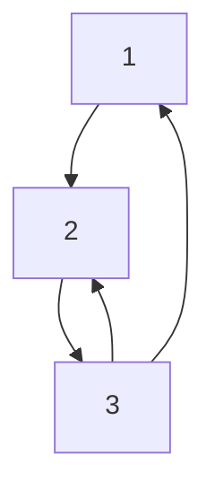

# Graph Creation

## Overview 

This project aims to determine the best strategy for Graph creation based on provided machine and its specifications.

### Input 

As an input we have Graphs described as an **unweighted** **directed** `edge list`. Data has been gathered from [Data sources](./data_sources). Here's an example below :

**Graphical representation**



**File content**

| Content |
| ------- |
| 1 2     |
| 2 3     |
| 3 1     |
| 3 2     |

### Output 

We need to create the graph using a certain **strategy** and save the graph as an `adjacency list`. The Structure of the adjacency list differs based on the data structure used ( explained in the technical overview ). Here's an example using a `vector of vectors` and the initial graph represented above.

```cpp
[
    [2],
    [3],
    [1, 2]
]
```

Our aim is to produce this representation in memory using minimal resources ( CPU / RAM )


## Technical Overview

The entire project was written in `c++`. And can be divided to two main parts

### Initial Implementation

Each of the strategies has its respective `cmake` project, making it simpler to test them individually

- `Parallel` : the parallel creation strategy
- `Sequential` : The sequential creation Strategy
- `Strategy3` : The sequential split creation strategy

Each of these projects will run the underlying strategy on the provided input. And then will calculate performance based on certain metrics.

### Newer Implementation

This implementation provides a couple of improvements to the initial one. Can be found under `/PFATeam` as a separate `cmake` project


#### Testing multiple Data Structures

We can now test multiple *Graph data structures* for each implementation ( which can differ in performance based on the provided initial graph)

**9 Adjacency list Strcutures have been implemented** : 

- `vector of vectors` : each vector representing the ajcent elements of 1 `vertex`
- `vector of sets`
- `vector of unordered sets` : Uses a hash function to index adjacent elements of each `vertex`
- `vector of lists`
- `map of vectors`
- `map of sets`
- `map of unordered sets`
- `unordered map of sets`
- `unordered map of unordered sets`

Note that These different structures can be used interchangebly since they share the same high level API. Which is described more in details in [graph_container.h](./PFATeam/graph/graph_container.h)

### Monitoring

Monitoring the performance of the tests takes into considerations 2 main aspects : 

- Ram consumed
- Time the algorithm has taken


#### Writing the Output

a generic [writer](./PFATeam/writer/writer.h) class has been implemented to encapsulate all write operations ( `csv`, `json`, `stdout`)

## Building the Project

This project is built using `cmake`. Prerequisites depend on the module you want to build.

- `C++ 20` or higher : The initial implementation only requires `C++ 14`
- `Boost C++ 1.7` or higher : required by the new implementation
  - `boost/chrono` : Used to calculate time


## Usage

